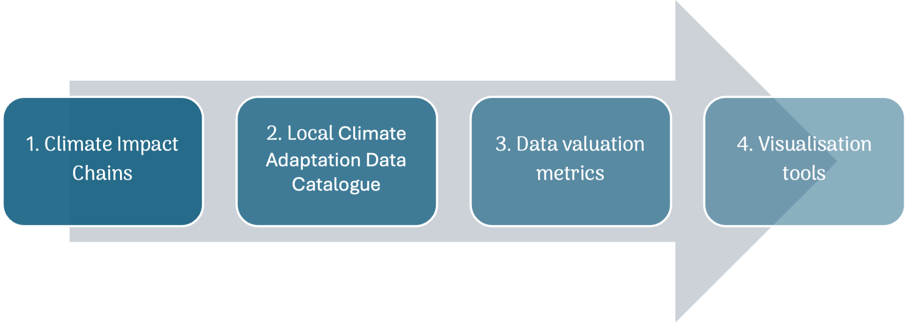

# VALORADA

The project behind this book is:

VALORADA (Validated Local Risk Actionable Data for Adaptation) is a Horizon Europe project (Grant Agreement No. 101112837) with the goal to empower European regions and cities to steer societal transformation toward sustainable, climate‑resilient development. It aligns with the EU Adaptation Mission supporting 150 regions to become climate‑resilient by 2030 through: 
- Accelerating societal transformations
- Demonstrating systemic adaptation pathways
- Improving access to and usability of climate data

The project reveals and enhances the “climate value” of locally collected socio‑economic, demographic and land‑use data by integrating it into risk understanding, adaptation planning and decision support. Practical instruments include Climate Impact Chains, an Indicator & Dataset Catalog (Excel + dashboard), a Climate‑data Valuation Framework, and visualisation examples.

Find out more: 
- [Project website](https://valorada-project.eu/about-valorada/)
- [Demonstrators](https://valorada-project.eu/demonstrators/)
- [EU Adapatation Mission](https://research-and-innovation.ec.europa.eu/funding/funding-opportunities/funding-programmes-and-open-calls/horizon-europe/eu-missions-horizon-europe/adaptation-climate-change_en)

This site contains more information about:
- Climate Impact Chains (CICs) co-developed with stakeholders in demonstrator regions.
- The Copernicus Climate Change Service (C3S) European Climate Data Explorer (ECDE) application and related datasets.
- The VALORADA Climate-data Valuation Framework used to assess the value of datasets for climate risk reduction. You can download it here.
- Indicator & Dataset Catalog: linked Excel view, static dashboard, and source repositories connecting indicators to CIC narratives and valuation criteria.

## 🧬 Climate Impact Chains

Cause–effect sequences linking climate hazards (heat, drought, wildfire, flood, etc.) to socio-economic and ecological impacts. Each chain page includes: * Main risk statement * Key policy issues * Sequential impact diagrams (with descriptive alternatives) * Narrative explaining mechanisms

## 📊 Data & Tools

How the ECDE application and derived Copernicus datasets support indicator-driven climate risk assessment and dashboards.

## 💠 Climate Data Valuation Framework

Structured criteria (Relevance, Strategic Value, Usability, Quality) with definitions, indicators, and scoring guidance to support transparent prioritisation of datasets.

## 🗂 Indicator & Dataset Catalog

VALORADA provides a catalogue of climate adaptation–relevant indicators and datasets, linking to Climate Impact Chains, valuation criteria, and dashboard visualisations. The content is rendered in different views:

A user‑friendly Excel table created by linking all data together. Download directly: catalog.xlsx
A static dashboard deployment: Static dashboard
Repository sources for further exploration: catalog repository and dashboard repository
These resources connect underlying indicators to the CIC narratives and the valuation framework criteria.